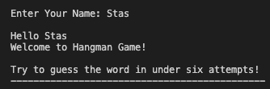
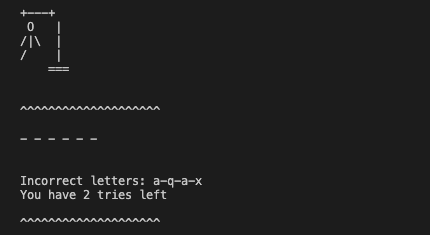
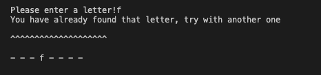
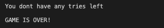
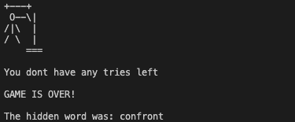
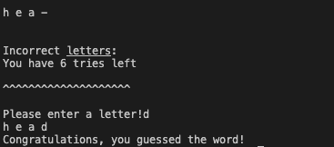
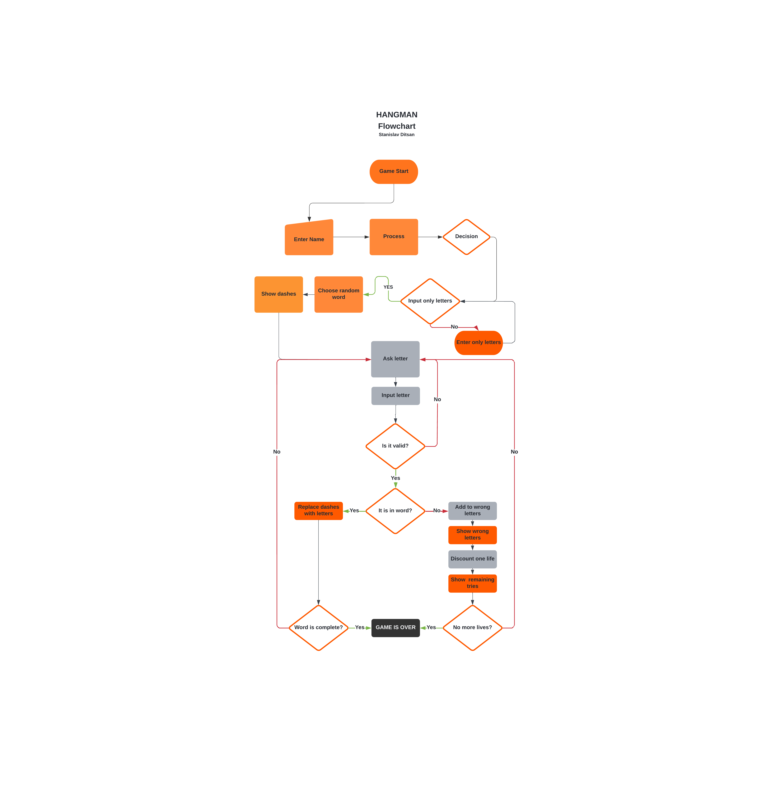
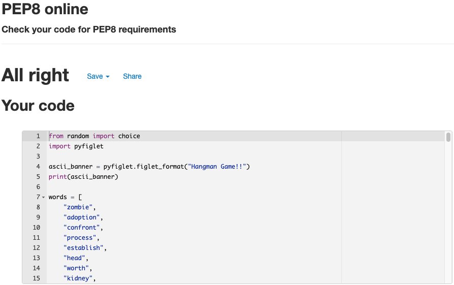
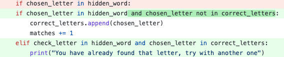

 

**Hangman** is a classic terminal based word game in which the aim is to discover the missing word.

### How to play?
You will be shown a number of blank areas that represent the missing letters you must discover.
To guess a letter, use the keyboard.
If your selected letter appears in the response, all locations where that letter appears will be disclosed.
After revealing multiple letters, you might be able to guess the solution and fill in the missing letters.
**Be warned**: every time you guess a letter incorrectly, you lose a life and the hangman appears in pieces. 

 
#### Here is the live version of Hangman Game click [here](https://hangmangamepp3.herokuapp.com/)

# Table of Content

- [UX](#user-experience)

- [Features](#features)

- [Flowchart](#flowchart)

- [Technologies Used and Tools](#technologies-used-and-tools)

- [Testing](#testing)
  - [Validator Testing](#validator-testing)

  - [Bugs](#bugs)
  
- [Deployment](#deployment)

  - [Using Github and Gitpod](#using-github-and-gitpod)

  - [Forking the GitHub Repository](#forking-the-github-repository)

  - [Cloning the GitHub Repository](#cloning-the-github-repository)
  
- [Creating an Application with Heroku](#creating-an-application-with-heroku)
  - [Heroku Settings](#heroku-settings)

  - [Deployment on Heroku](#deployment-on-heroku)

- [Acknowledgements](#acknowledgements)

  

  

# User Experience
## As a first time user I am able to:

- Enter my name to start the game 

- Able of seeing my name with greeting

- See information about how many tries I have for the game 

- Be able to see printed dashes to guess a word 

- See how many tries I still have left before the game is over 

- Be able to see the list of incorrect letters 

- Be able to see "hangman" being printed on every incorrect guesses letter 

- Be able to see a warning if I've previously used the same letter. 

- Able to get a warning indicating I had reached my limit of tries. 

- Able to see if the game is over when run out of tries 

- Be able to see the hidden world if I lose the game 

- See congratulation alert if I win the game 

# Features

Existing Features

- Accept user name 
- Welcome the user by announcing their name 
- Inform the user of how many attempts they have in the game before the game ends

 

- Display current tries 
- Display incorrect letters
- Print the Hangman every time the user enters an incorrect letter

 

- Inform the user that a certain letter has previously been used

 

- When user run out of attempts, notify the user
- Alert the user that the game is over

 

- If the user loses the game, show the hidden word

 

- If the game is won, congratulate the user

 

# Future Features

- Provide a tip to the user by exposing a letter after a few incorrect tries

- Allow the user to add an extensive word library

# Flowchart

 

# Technologies Used and Tools

- [Python](https://www.python.org/) To provide the functionality to the program
- [Lucid](https://lucid.app/) Was used to create the flow chart
- [GitPod](https://gitpod.io/) Was used to edit code within the project for the site and to push commitments
- [GitHub](https://github.com/) Was used to create the repository and store the project code after it has been pushed from Git
- [Heroku](https://dashboard.heroku.com/) Used to deploy application
- [PEP8](http://pep8online.com/) Used to check the code for any problems or faults
- [Pyfiglet](https://pypi.org/project/pyfiglet/) Used to include a banner with a large typeface

# Testing

### I manually tested the project by performing the following:

- Checked the code by using a PEP8 to ensure that there are no issues

- Provided incorrect inputs when just letters are required, and checked for errors if the same letter is input continuously

- I tested it at my local terminal as well as the Heroku terminal

### Validator Testing 

- [PEP8](http://pep8online.com/) returned no problems

 

### Bugs

- When inputting the letter for the right concealed word, for example, "head," if the user inputs "h" six times in a raw, the program will count it as a valid predicted word.
The error was in the check-letter function. Additional condition had to be added to see if it had not already been included to the right letters list.

 

- To prevent stop losing the tries. Elif was added to check if chosen letter in hidden word and chosen letter is in correct letter. If it appears in both lists, it means that the letter has previously been discovered and is being repeated. Instead of loosing a try the warning will be printed for the user **"You have already found that letter, try with another one"**

# Deployment

### Using Github and Gitpod

I had to utilize the [Code Institute Python Essentials Template](https://github.com/Code-Institute-Org/python-essentials-template) to launch my command-line interface application since it allows the program to be correctly seen on Heroku using a mock terminal.

- Select the Use This Template box.
- Give the repository a name and a brief description.
- To create your repository, click the Create Repository from Template button.
- To build a Gitpod workspace, click Gitpod, which can take a few minutes.
- When you wish to work on the project, access the workspace from Gitpod rather than Github since this will open your old workspace rather than generating a new one.
- You should pin the workspace to prevent it from being removed.
- Committing your work should be done frequently and with clear/explanatory messages; use the following commands to do so:

  - git add.: This command adds all changed files to a staging area.
  - The command git commit -m "A message describing your commit" commits all changes to a local repository.
  - git push: commits all of your changes to your Github repository.

### Forking the GitHub Repository

- If you wish to make modifications to your repository without altering the original, you may 'Fork' it. This guarantees that your original repository is not altered.

1. Locate the appropriate GitHub repository.
2. Click the Fork button in the upper right corner of the page
3. Your repository has been 'Forked,' and you now have a copy to work with.

### Cloning the GitHub Repository

- Cloning your repository will allow you to work on a local version of the repository. Cloning is also an excellent method for backing up your work.

1. Locate the appropriate GitHub repository.
2. Click the arrow next to the Code button.
3. Copy the URL presented in the drop-down. 
4. Open Gitpod and choose the directory location where you want the clone to be produced.
5. In the terminal, run 'git clone' and then paste the link you copied in GitHub.
6. Press enter to make your local clone.

# Creating an Application with Heroku

### Using the Code Institute lesson, I performed the following steps:

- The Gitpod CLI 'pip3 freeze —local > requirements.txt' will generate the necessary files for Heroku to install your project dependencies. Please keep in mind that this file should be placed to a.gitignore file to prevent it from being committed.

1. Log in to [Heroku.com](https://dashboard.heroku.com/apps) if you do not already have an account; if you do not already have an account, you will need to create one.
2. Select 'Create New App' from the 'New' dropdown menu.
3. Give your new project a name; all Heroku apps must have a unique name; you will be notified if you need to modify it.
4. Choose the region in which you will be working.

### Heroku Settings

- You will need to configure your Environment Variables - this is a critical step in ensuring your application is correctly deployed.
- Click on 'Reveal Config Vars' on the Settings tab and enter the following variables:
- If you are using credentials, you must add the credentials as a variable, with the key being the name 'CREDS' and the value being the contents of your creds. JSON
- Insert the key 'PORT' and the value '8000'.
- Buildpacks are also necessary for effective deployment; simply click the 'Add buildpack' button and search for the ones you need.
- I needed to include 'Python' and 'Node.js' in this sequence for this project.

### Deployment on Heroku
#### Follow these instructions to connect your Heroku account to your Github repository:
- In the Deploy tab, click:

1. Select 'Github-Connect to Github' from the 'Deploy' menu.
2. Enter the GitHub repository name and press the 'Search' button.
3. Select the appropriate repository for your application and click 'Connect.'
2. You may then select whether to deploy the project manually or automatically. Automatic deployment will create a new application every time you make a modification to Github, whereas manual deployment requires you to click the 'Deploy Branch' button every time you want a change done.
3. After you've selected your deployment method and hit 'Deploy Branch,' your application will be generated and you should see the 'View' button below; click this to launch it.

# Credits

- Inspiration for the format of my README comes from the Code Institute Sample README.md, my previous README, and other students I met throughout this project.
- Federico Garay's for directions and professional explanation were really helpful in the development of this project.
- Some code-related questions have been resolved using Stack Overflow.
- W3Schools is used for problem solving.
- Slack community for providing answers to my questions.

# Acknowledgements

Gratitude to my mentor Harry Dhillon, the Code Institute, and the Slack community.
